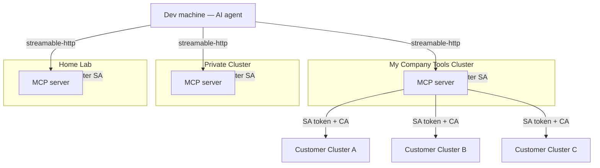
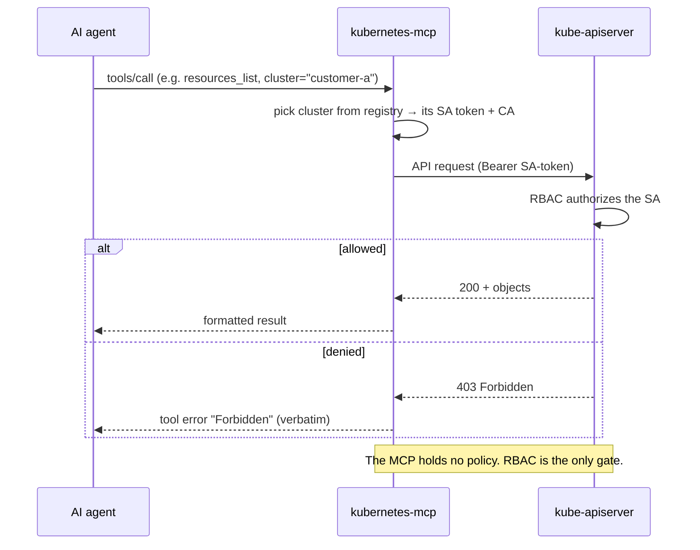
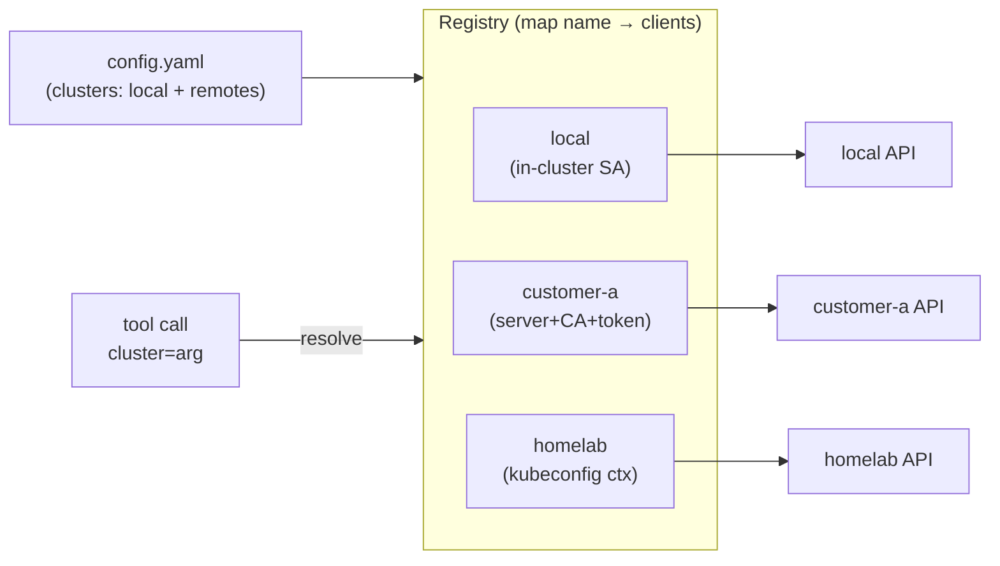
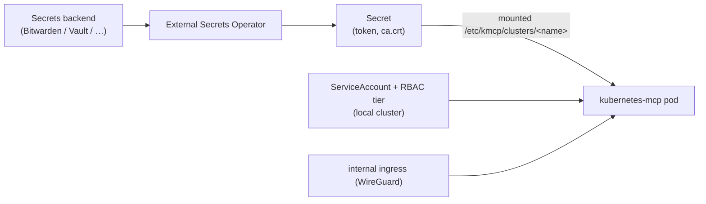

# kubernetes-mcp

An **MCP (Model Context Protocol) server for Kubernetes**. It lets an AI agent
(Claude Code, Cursor, …) inspect and operate one or more Kubernetes clusters.

It is built on one principle: **authentication and authorization stay on the
Kubernetes side.** The server holds only ServiceAccount credentials and every
request is authorized by Kubernetes **RBAC** — there is no custom auth, no policy
engine, no "own magic" in the MCP.

- **Runs anywhere** — inside a cluster (using its projected ServiceAccount token)
  or standalone (using tokens + CAs for remote API servers).
- **Manages many clusters** from one instance; the caller picks the target with a
  `cluster` tool argument.
- **Many instances per agent** — run one MCP per network zone and add them all to
  your agent (see [client config](#configure-your-ai-agent)).
- **Streamable-HTTP transport**, deployable via the bundled **Helm chart** with
  **ESO**-managed secrets.

## Topology

The AI agent connects to several MCP instances (one per zone); each instance
manages its own cluster and, optionally, remote clusters.



Two independent levels of multiplicity: **many MCP instances per agent** (client
config) and **many clusters per instance** (the server's cluster registry).

## Central auth model



## Cluster registry (server internals)



Each cluster entry builds a typed client, a dynamic client (for any GVK/CRD) and
a REST mapper — once, up front. File-based tokens/CAs are re-read on use, so
rotating (projected / ESO) credentials are picked up without a restart.

## Deployment & secrets (ESO)



## Tools

All tools take an optional `cluster` (defaults to the configured default cluster).

| Tool | Purpose |
|------|---------|
| `clusters_list` | list managed clusters + reachability + read-only flag |
| `namespaces_list` | list namespaces |
| `resources_list` | list any kind by `apiVersion`+`kind` (built-in or CRD) |
| `resources_get` | get one object (Secret values redacted) |
| `pods_list` | pods with phase/ready/node |
| `pods_log` | container logs |
| `events_list` | events, newest last |
| `nodes_list` | nodes + readiness |
| `resources_apply` * | server-side apply a manifest |
| `resources_delete` * | delete an object |
| `deployment_scale` * | scale a Deployment |
| `rollout_restart` * | restart a Deployment/StatefulSet/DaemonSet |

`*` mutating — blocked when the instance or cluster is `readOnly`, and ultimately
governed by RBAC.

## Quick start (local, against your kubeconfig)

```bash
cat > /tmp/kmcp.yaml <<'EOF'
defaultCluster: dev
clusters:
  - name: dev
    kubeconfigFile: /root/.kube/config
    context: my-context
EOF
go run . --config /tmp/kmcp.yaml
# MCP endpoint: http://0.0.0.0:9090/mcp   health: /healthz /readyz
```

See [`examples/config.yaml`](./examples/config.yaml) for all three auth modes
(in-cluster, explicit token+CA, kubeconfig context).

## Configure your AI agent

Add one entry per MCP instance. Full examples:
[`examples/mcp.claude.json`](./examples/mcp.claude.json),
[`examples/mcp.cursor.json`](./examples/mcp.cursor.json).

```bash
claude mcp add --transport http k8s-tools   https://kubernetes-mcp.intern.tools.averion.zone/mcp
claude mcp add --transport http k8s-homelab https://kubernetes-mcp.homelab.example.com/mcp
```

## Deploy (Helm + ESO)

```bash
helm install my-mcp deploy/helm/kubernetes-mcp -n kubernetes-mcp --create-namespace \
  --set localCluster.rbac.tier=read-only
```

Configurable RBAC tiers for the local cluster and ESO-managed remote-cluster
credentials — see the [chart README](./deploy/helm/kubernetes-mcp/README.md).

## ServiceAccounts for target clusters

Ready-to-apply examples for **read-only**, **full-access** and **fine-grained**
ServiceAccounts, plus a script to extract the `server`/CA/token for the MCP
config: [`deploy/rbac/`](./deploy/rbac/).

## Security model

The streamable-HTTP transport has **no built-in authentication** (by design —
auth is Kubernetes'). Expose it only on a trusted / internal ingress (e.g.
WireGuard), optionally with basic-auth. **Never expose it publicly.** Defense in
depth: a global `readOnly` switch and per-cluster `readOnly` flag can disable all
mutations regardless of RBAC.

## Testing

```bash
make test            # unit tests (fake clients)
make test-e2e        # E2E: real kube-apiserver (envtest) driven through the MCP
make test-e2e-kind   # E2E: real kind cluster, real pod logs
```

See [`docs/architecture.md`](./docs/architecture.md) for more detail and
[`docs/environments-integration.md`](./docs/environments-integration.md) for
deploying via the `environments` GitOps repo.

## Development

Go 1.25, [official MCP Go SDK](https://github.com/modelcontextprotocol/go-sdk),
`client-go`. Layout: `internal/config` (config), `internal/clusters` (registry +
credentials), `internal/k8s` (generic GVK access), `internal/mcpserver` (tools).
