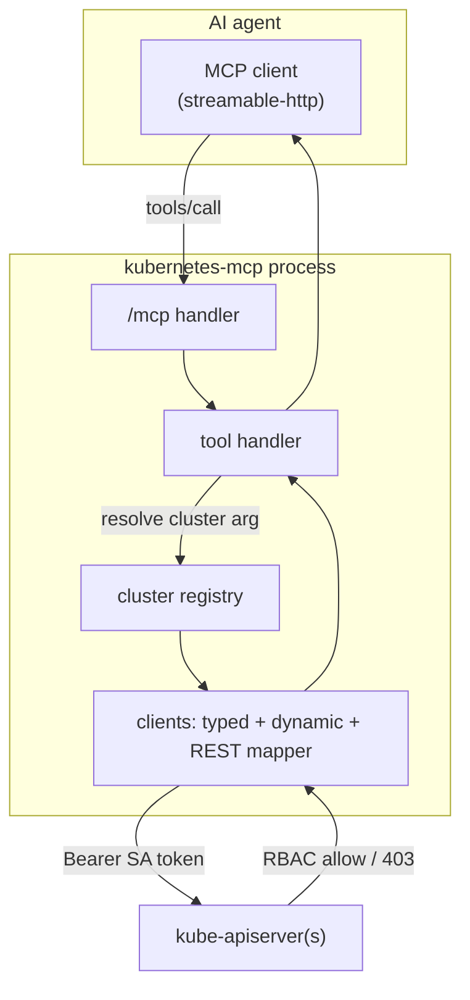
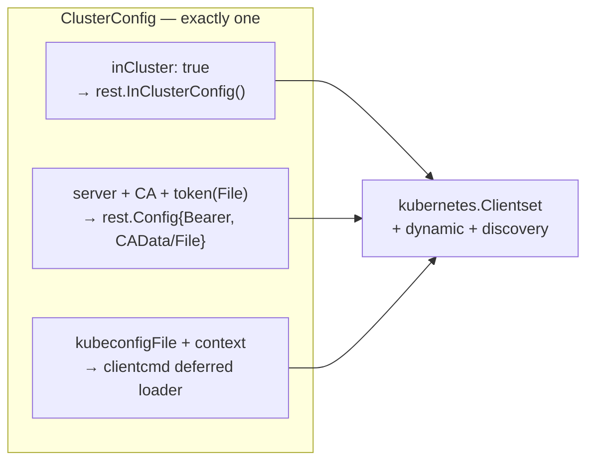
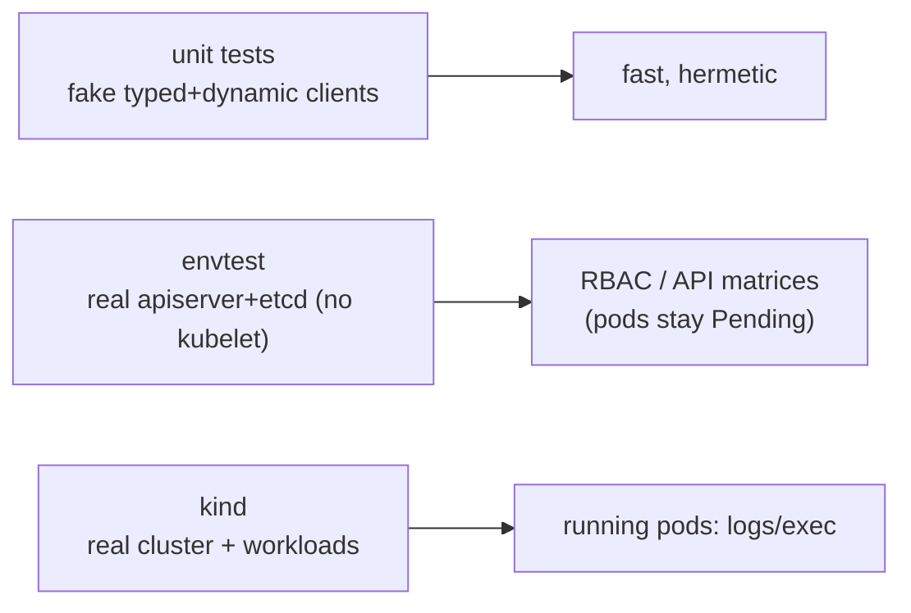

# Architecture

## Request flow

## Packages

| Package | Responsibility |
|---------|----------------|
| `internal/config` | Load/validate `config.yaml` + `KMCP_*` env. One auth mode per cluster; DNS-label names; default-cluster checks. |
| `internal/clusters` | Build a thread-safe registry of clusters. `credentials.go` turns a `ClusterConfig` into a `rest.Config` (in-cluster / explicit token+CA / kubeconfig context), preferring file forms for rotation. Each `Cluster` holds typed + dynamic + discovery clients and a resettable REST mapper. |
| `internal/k8s` | Generic GVK→GVR resolution and list/get/apply(SSA)/delete/patch via the dynamic client, so tools work for built-ins and CRDs alike. |
| `internal/mcpserver` | Registers the MCP tools, resolves the target cluster/namespace per call, formats output (Secret values redacted), and enforces the read-only guard before mutations. |
| `main.go` | Wire it together, serve `/mcp` + `/healthz` + `/readyz`, graceful shutdown. |

## Authentication modes

- **In-cluster** uses the pod's projected token (`BearerTokenFile`), which
  client-go re-reads as it rotates.
- **Explicit** remote clusters use a SA token + CA. File forms (`tokenFile`,
  `certificateAuthorityFile`) rotate transparently; inline forms are supported
  but discouraged. `insecureSkipTLSVerify` exists but must never be used in prod.
- **Kubeconfig** selects a named context from a mounted kubeconfig.

## Why RBAC-only

The MCP never evaluates permissions. It presents a token; the API server's
authenticator + RBAC authorizer decide. Consequences:

- The *same* MCP binary is read-only or powerful depending solely on the token's
  RBAC — proven by the E2E suite (`test/e2e/e2e_rbac_test.go`).
- 403/404 from Kubernetes are surfaced verbatim to the agent, so denials are
  legible.
- Provisioning access = creating a ServiceAccount + Role/ClusterRole in the
  target cluster (see `deploy/rbac/`).

## Testing strategy

- **Unit** (`internal/**`) — handler logic, config validation, registry, guards.
- **envtest** (`test/e2e`) — a real kube-apiserver; mint SA tokens via
  TokenRequest and drive the MCP over streamable-http; assert reads work and
  RBAC-denied writes 403.
- **kind** (`test/e2e/kind`, build tag `e2e_kind`) — real workloads for
  `pods_log`.
