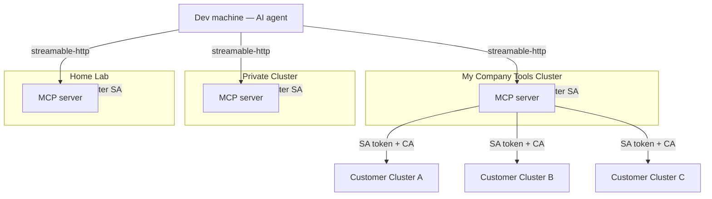

# Kubernetes MCP — Implementation Plan

> **Status:** Planning complete. No code written yet.
> **Companion doc:** [`kubernetes-mcp-process.md`](./kubernetes-mcp-process.md) — filled in **during** implementation, one entry per completed step, so work can be paused and resumed at any time.
> **Audience:** An AI code assistant (or human) implementing this repo step by step.

---

## 0. Goal & Context

Build a **Kubernetes MCP server** — an [MCP (Model Context Protocol)](https://modelcontextprotocol.io) server that lets an AI agent manage Kubernetes clusters. It is deployed once per network zone and talks to one or more Kubernetes API servers using **Kubernetes ServiceAccount tokens**, so **all authentication and authorization stay on the Kubernetes side via RBAC** — the MCP contains **no custom auth logic**.

### Desired topology (from the reference screenshot)

There are **two independent levels of multiplicity**:

1. **Many MCP instances per AI agent.** The dev machine running the AI agent is configured with several MCP server instances — one per network zone (e.g. "My Company Tools Cluster", "Private Cluster", "Home Lab"). This is pure **MCP client config** (`.mcp.json`) and needs no server code — but it must be documented and the server must be safe to run many times.
2. **Many clusters per MCP instance.** A single MCP instance (e.g. the one in "My Company Tools Cluster") manages **its own cluster and several remote clusters** (Customer Cluster A/B/C). This is the **cluster registry** inside the server: the caller selects the target cluster via a tool argument.

```
Dev machine (AI agent)
 ├── MCP "tools"    → in-cluster SA (tools cluster) + SA tokens for Customer A / B / C
 ├── MCP "private"  → in-cluster SA (private cluster)
 └── MCP "homelab"  → in-cluster SA (home lab)
```

### Hard requirements (from the request)

- Run **anywhere** (in-cluster or standalone), talk to **remote or local** Kubernetes APIs.
- Auth **only** via Kubernetes ServiceAccount tokens + RBAC — no bespoke auth.
- Manage **multiple clusters** from one instance.
- A **Helm chart** to deploy it.
- Support configuring **multiple MCP instances** for one AI agent (client side).
- **Unit tests** and **E2E tests** that run a **local Kubernetes API** and drive the MCP end-to-end to fetch real data. **These must be written and actually run.**
- **Good README** with **Mermaid** diagrams.
- **Example ServiceAccount manifests** for **read-only**, **full-access**, and **fine-grained** permissions.
- In the chart, those cluster secrets must be **configurable via ESO (External Secrets Operator)**.

### Technology decisions (validated by research — see `## Appendix A`)

| Concern | Decision | Rationale |
|---|---|---|
| Language | **Go 1.25** | `client-go` is the canonical K8s client; matches `scaleway-exporter` in this workspace. |
| K8s client | `k8s.io/client-go` (typed) + `k8s.io/client-go/dynamic` + `discovery`/`restmapper` | Typed for common resources, dynamic for generic GVK access. |
| MCP SDK | **`github.com/modelcontextprotocol/go-sdk`** (official, v1.x GA) | GA with stability guarantee, Google co-maintained, tracks spec first. |
| Transport | **Streamable HTTP only** (`/mcp`) | stdio+SSE is deprecated; streamable-http is what remote clients use. |
| Auth to clusters | In-cluster SA (`rest.InClusterConfig`) or per-cluster `{server, CA, token}` via `rest.Config` with `BearerTokenFile` | No custom auth; RBAC decides; `BearerTokenFile` auto-reloads rotating tokens. |
| Prior art to study | **`containers/kubernetes-mcp-server`** (Go, Apache-2.0) | Same design; validates approach. Study, do not copy license-incompatibly. |
| Unit tests | `client-go/kubernetes/fake` + `dynamic/fake` | Fast, hermetic handler tests. |
| E2E (primary) | **envtest** (`sigs.k8s.io/controller-runtime/pkg/envtest`) | Real kube-apiserver + etcd, no Docker; perfect for RBAC/API assertions. |
| E2E (workloads) | **kind** (one CI job) | Real running pods for logs/exec assertions. |
| CI | GitLab CI → `registry.gitlab.com/ai-guard/kubernetes-mcp` | Matches `qdrant-mcp-server` / workspace convention. |
| Image | Multi-stage distroless nonroot, **multi-arch `linux/amd64,linux/arm64`** | Matches `scaleway-exporter/Dockerfile` (`--platform=$BUILDPLATFORM` + `TARGETOS/TARGETARCH` cross-compile); arm64 for Apple-silicon dev + arm nodes. |
| Deploy target | `environments` GitOps repo (myks+ytt+Helm+Argo, Bitwarden ESO) | Documented; actual prototype PR is out of scope for this repo. |

### Reference files in this workspace (study before/while implementing)

- `../scaleway-exporter/Dockerfile` — distroless multi-stage Go build.
- `../scaleway-exporter/charts/scaleway-exporter/` — Helm chart layout (`Chart.yaml`, `values.yaml`, `templates/{deployment,service,secret,_helpers,servicemonitor}.yaml`).
- `../scaleway-exporter/integration_mock_test.go` — Go `httptest` integration-test style; `internal/…` package layout.
- `../qdrant-mcp-server/.gitlab-ci.yml` + `Dockerfile` + `README.md` — MCP image CI (`docker buildx`, tag `$CI_PIPELINE_ID` + `latest`, default-branch only) and MCP README conventions (streamable-http, internal ingress only, never public).
- `../environments/prototypes/weaviate/` — MCP behind `nginx-internal` ingress with streaming annotations; Helm-via-vendir + ytt overlays.
- `../environments/prototypes/io-averion-alert-bot/` — simple Go HTTP service prototype (deployment, service, ingress, ESO, image-pull-secret).
- `../environments/prototypes/external-secrets/ytt/bitwarden-secretstore.yaml` — `ClusterSecretStore` (Bitwarden Secrets Manager, EU).
- `../environments/docs/wireguard-internal-ingress.md` — internal ingress conventions.

---

## 1. Target repository layout

```
kubernetes-mcp/
├── go.mod                       # module gitlab.com/ai-guard/kubernetes-mcp, go 1.25
├── go.sum
├── main.go                      # entrypoint (flags/env → config → registry → MCP HTTP server)
├── internal/
│   ├── config/
│   │   ├── config.go            # Config structs + Load() + Validate()
│   │   └── config_test.go
│   ├── clusters/
│   │   ├── registry.go          # Registry: map[name]*Cluster, thread-safe
│   │   ├── cluster.go           # per-cluster clients (typed, dynamic, discovery, mapper)
│   │   ├── credentials.go       # rest.Config builders (in-cluster / token / kubeconfig)
│   │   └── registry_test.go
│   ├── mcpserver/
│   │   ├── server.go            # build mcp.Server, register tools, streamable-http handler
│   │   ├── tools_read.go        # read-only tools
│   │   ├── tools_write.go       # mutating tools (guarded)
│   │   ├── params.go            # shared arg structs + cluster/namespace resolution
│   │   ├── format.go            # output formatting (table/JSON/yaml → text)
│   │   └── tools_test.go
│   └── k8s/
│       ├── resources.go         # generic GVK→REST mapping, list/get/apply/delete via dynamic
│       └── resources_test.go
├── test/
│   └── e2e/
│       ├── envtest_main_test.go # envtest bootstrap (TestMain)
│       ├── e2e_read_test.go     # drive MCP over streamable-http against envtest
│       ├── e2e_rbac_test.go     # readonly vs edit vs fine-grained token assertions
│       └── kind/
│           ├── e2e_kind_test.go # build tag `e2e_kind`; real pod logs
│           └── setup-kind.sh
├── deploy/
│   ├── helm/
│   │   └── kubernetes-mcp/       # the Helm chart (see Step 11)
│   └── rbac/
│       ├── read-only/            # SA + ClusterRole (get/list/watch, no secrets) + binding + script
│       ├── full-access/          # SA + cluster-admin binding + script
│       ├── fine-grained/         # SA + namespaced Role + RoleBinding + script
│       └── README.md
├── examples/
│   ├── config.yaml               # sample server cluster-registry config
│   ├── mcp.claude.json           # multiple MCP instances (Claude Code)
│   └── mcp.cursor.json           # multiple MCP instances (Cursor)
├── docs/
│   ├── architecture.md           # Mermaid diagrams (source of truth, embedded in README)
│   └── environments-integration.md # how to add the prototype to the environments GitOps repo
├── Dockerfile
├── .dockerignore
├── .gitignore
├── .gitlab-ci.yml
├── Makefile                      # dev shortcuts (build/test/lint/e2e/helm-lint)
├── README.md
├── kubernetes-mcp-plan.md        # this file
└── kubernetes-mcp-process.md     # implementation log
```

---

## 2. Server configuration model (design contract)

The server reads a **YAML config** (path via `--config` / `KMCP_CONFIG`) plus env overrides. This is the contract every step builds against.

```yaml
# examples/config.yaml
listenAddr: "0.0.0.0:9090"     # KMCP_LISTEN_ADDR
logLevel: "info"               # debug|info|warn|error ; KMCP_LOG_LEVEL
readOnly: false                # global kill-switch for all mutating tools; KMCP_READ_ONLY
defaultCluster: "local"        # used when a tool call omits `cluster`
clusters:
  # (a) the cluster the pod runs in — uses the projected SA token automatically
  - name: local
    inCluster: true
    readOnly: false            # per-cluster override (defense-in-depth on top of RBAC)
    defaultNamespace: ""       # optional; "" means all-namespaces for list ops

  # (b) a remote cluster via an explicit SA token + CA (files preferred: auto-reload + ESO)
  - name: customer-a
    server: "https://api.customer-a.example.com:6443"
    certificateAuthorityFile: "/etc/kmcp/clusters/customer-a/ca.crt"   # or `certificateAuthorityData: <base64>`
    tokenFile: "/etc/kmcp/clusters/customer-a/token"                   # or `token: <inline>` (discouraged)
    readOnly: true
    defaultNamespace: ""
    insecureSkipTLSVerify: false   # must stay false in prod; never default true

  # (c) a cluster selected from a mounted kubeconfig context
  - name: homelab
    kubeconfigFile: "/etc/kmcp/kubeconfig"
    context: "homelab"
```

**Rules the code must enforce (Validate()):**
- Exactly one auth mode per cluster: `inCluster: true` XOR (`server`+CA+token) XOR (`kubeconfigFile`+`context`).
- `defaultCluster` must exist in `clusters`.
- Cluster names unique, non-empty, DNS-label-safe (used in tool args & logs).
- `insecureSkipTLSVerify` may be true only if a CA is absent; log a loud warning; never in the Helm defaults.
- If both file and inline forms are given for CA/token, file wins and a warning is logged.

**Tool cluster/namespace resolution (shared):** every tool accepts optional `cluster` (falls back to `defaultCluster`) and, where relevant, `namespace` (falls back to the cluster's `defaultNamespace`, then all-namespaces or the tool's own default). Unknown cluster → structured tool error listing valid names.

---

## 3. Tool surface (design contract)

All tools take `cluster?: string`. Resource tools also take `namespace?`, `apiVersion`/`kind` or a convenience alias. Output: human-readable text plus, where useful, embedded JSON; errors returned as MCP tool errors (never panics). Kubernetes 403/404 are surfaced verbatim so RBAC denials are legible to the agent.

**Read-only tools (Step 4):**
- `clusters_list` — configured clusters + reachability (server version) + readOnly flag.
- `namespaces_list`
- `resources_list` — `{cluster, apiVersion, kind, namespace?, labelSelector?, fieldSelector?}` via dynamic client + restmapper (works for any GVK/CRD).
- `resources_get` — `{cluster, apiVersion, kind, name, namespace?}`.
- `resources_describe` — human-readable describe-style output for a single object.
- `pods_list` — convenience wrapper (`{cluster, namespace?, labelSelector?}`) incl. phase/ready/restarts.
- `pods_log` — `{cluster, namespace, name, container?, tailLines?, previous?}`.
- `events_list` — `{cluster, namespace?}` sorted by lastTimestamp.
- `nodes_list` — nodes + status/roles/version.
- *(optional)* `nodes_top` / `pods_top` — metrics.k8s.io if available; degrade gracefully if not.

**Mutating tools (Step 5) — gated by global `readOnly` AND per-cluster `readOnly`; RBAC is still the real gate:**
- `resources_apply` — server-side apply of a YAML/JSON manifest `{cluster, manifest}`.
- `resources_delete` — `{cluster, apiVersion, kind, name, namespace?}`.
- `pods_delete` — `{cluster, namespace, name}`.
- `deployment_scale` — `{cluster, namespace, name, replicas}`.
- `rollout_restart` — `{cluster, namespace, kind(Deployment|StatefulSet|DaemonSet), name}` (patch template annotation).

When a mutating tool is blocked by config, return a clear tool error (`"writes disabled for cluster 'x' (readOnly)"`) **without** calling the API.

---

## 4. Step-by-step implementation

> Each step lists: **files**, **what to do**, **acceptance check**. After finishing a step, append a detailed entry to `kubernetes-mcp-process.md` (see its template) **before** starting the next.

### Step 1 — Repo scaffolding & module

**Files:** `go.mod`, `.gitignore`, `.dockerignore`, `Makefile`, `README.md` (stub).

- `go mod init gitlab.com/ai-guard/kubernetes-mcp`; set `go 1.25`.
- Add deps (let `go get` pin latest compatible):
  - `k8s.io/client-go`, `k8s.io/api`, `k8s.io/apimachinery` (align minor versions, e.g. v0.32.x).
  - `github.com/modelcontextprotocol/go-sdk` (pin a **v1.x** tag; verify API on pkg.go.dev — the tool-registration return shape evolved across minors).
  - `sigs.k8s.io/yaml` (manifest parsing), `sigs.k8s.io/controller-runtime` (envtest, test-only).
- `.gitignore`: `/bin/`, `/dist/`, `*.out`, `kubeconfig`, `.env`, envtest assets dir.
- `.dockerignore`: `.git`, `test/`, `*.md`, `deploy/`, `docs/`, `examples/`, `bin/`.
- `Makefile` targets: `build`, `test`, `test-e2e`, `test-e2e-kind`, `lint`, `helm-lint`, `run`, `tidy`.
- **Acceptance:** `go build ./...` succeeds on an empty `main.go` printing version; `go mod tidy` clean.

### Step 2 — Config package

**Files:** `internal/config/config.go`, `internal/config/config_test.go`, `examples/config.yaml`.

- Implement the structs from `## 2`, `Load(path) (*Config, error)` (YAML + env overrides via `KMCP_*`), and `Validate()`.
- Env overrides: `KMCP_LISTEN_ADDR`, `KMCP_LOG_LEVEL`, `KMCP_READ_ONLY`, `KMCP_DEFAULT_CLUSTER`, `KMCP_CONFIG`.
- **Acceptance:** unit tests cover: valid multi-cluster file; each invalid case in `## 2` rules; env override precedence; file-vs-inline CA/token precedence. `go test ./internal/config/...` green.

### Step 3 — Cluster registry & credentials

**Files:** `internal/clusters/credentials.go`, `internal/clusters/cluster.go`, `internal/clusters/registry.go`, `internal/clusters/registry_test.go`.

- `credentials.go`: `restConfigFor(cfg ClusterConfig) (*rest.Config, error)`:
  - `inCluster` → `rest.InClusterConfig()`.
  - explicit → `&rest.Config{Host, BearerTokenFile|BearerToken, TLSClientConfig{CAData|CAFile, Insecure}}`; set `QPS: 50, Burst: 100`.
  - kubeconfig → `clientcmd.NewNonInteractiveDeferredLoadingClientConfig(&clientcmd.ClientConfigLoadingRules{ExplicitPath: file}, &clientcmd.ConfigOverrides{CurrentContext: context})`.
  - **Prefer `BearerTokenFile`/`CAFile`** over inline so rotating (projected/ESO) creds auto-reload.
- `cluster.go`: `type Cluster` holding `name`, `readOnly`, `defaultNamespace`, `*kubernetes.Clientset`, `dynamic.Interface`, `discovery.DiscoveryInterface`, and a cached `meta.RESTMapper` (deferred/reloading). Constructor builds all clients from the `rest.Config`.
- `registry.go`: `type Registry` = `map[string]*Cluster` + `sync.RWMutex`; `Build(cfg *Config)`; `Get(name)`; `Names()`; `Default()`. Build each clientset **once** (goroutine-safe, pools connections).
- Add `Ping(ctx)` (server version) for `clusters_list` reachability, non-fatal at startup (a remote cluster being down must not crash the server).
- **Acceptance:** `registry_test.go` builds a registry from a config using an httptest TLS server that fakes `/version` + a CA; asserts `Get`/`Names`/`Default` and that a bad cluster name errors. `go test ./internal/clusters/...` green.

### Step 4 — Generic resource layer + read-only tools

**Files:** `internal/k8s/resources.go`, `internal/k8s/resources_test.go`, `internal/mcpserver/params.go`, `internal/mcpserver/format.go`, `internal/mcpserver/tools_read.go`, `internal/mcpserver/server.go`.

- `internal/k8s/resources.go`: helpers `List/Get/Apply/Delete` via `dynamic.Interface` + `restmapper` (map `apiVersion`+`kind` → GVR, decide namespaced vs cluster-scoped). Reset mapper on `NoMatch` to pick up freshly-installed CRDs.
- `params.go`: shared arg structs; `resolveCluster(reg, arg)` and `resolveNamespace(cluster, arg)`.
- `format.go`: compact table/summary + JSON for objects/lists; redact `Secret` `data` values (show keys only) by default.
- `server.go`: `NewServer(reg, cfg) *mcp.Server`; register each tool via `mcp.AddTool`; typed input structs → SDK generates the JSON schema.
- Implement the read-only tools from `## 3`. Every handler: resolve cluster → call k8s → format → return; wrap errors as tool errors.
- **Acceptance:** `tools_test.go` (Step 7 expands it) exercises handlers with `fake` clients; manual `go run` against a kubeconfig lists namespaces. `go build ./...` green.

### Step 5 — Mutating tools (guarded)

**Files:** `internal/mcpserver/tools_write.go` (+ `params.go` guard helper).

- Implement mutating tools from `## 3`. Central guard `assertWritable(cluster) error` that checks global `cfg.ReadOnly` and `cluster.readOnly` **before** any API call.
- `resources_apply`: parse manifest (`sigs.k8s.io/yaml`), server-side apply (`FieldManager: "kubernetes-mcp"`).
- `rollout_restart`: strategic-merge patch setting `spec.template.metadata.annotations["kubectl.kubernetes.io/restartedAt"]` (timestamp injected at call time).
- **Acceptance:** unit tests assert guard blocks writes when `readOnly` and that allowed writes hit the fake client. Green.

### Step 6 — Entrypoint wiring

**Files:** `main.go`.

- Flags/env → `config.Load` → `clusters.Build` → `mcpserver.NewServer` → `mcp.NewStreamableHTTPHandler` mounted at `/mcp`.
- Add `/healthz` (process up) and `/readyz` (default cluster reachable OR explicitly degraded). Structured logging (slog). Graceful shutdown on SIGINT/SIGTERM. `--version` flag (ldflags-injected).
- **Security note in code + README:** the streamable-http transport has **no built-in auth**; protect via internal ingress (WireGuard / basic-auth) exactly like `qdrant-mcp-server`. Bind to `0.0.0.0` only inside the cluster; document not exposing publicly.
- **Acceptance:** `go run . --config examples/config.yaml` starts, `/healthz` returns 200, `/mcp` speaks MCP (verified in Step 8).

### Step 7 — Unit tests

**Files:** `internal/mcpserver/tools_test.go` (+ any gaps in earlier `_test.go`).

- Use `k8s.io/client-go/kubernetes/fake` and `k8s.io/client-go/dynamic/fake` seeded with namespaces, pods, deployments, a CRD instance.
- Cover: `resources_list`/`get` (incl. a CRD via dynamic), `pods_list`/`pods_log`, `namespaces_list`, cluster-selection fallback to default, unknown-cluster error, readOnly guard on every mutating tool, Secret redaction.
- **Acceptance:** `go test ./...` (non-e2e) green; **run it and record output** in the process log.

### Step 8 — E2E tests against a local API (envtest) — **primary**

**Files:** `test/e2e/envtest_main_test.go`, `test/e2e/e2e_read_test.go`, `Makefile` (`test-e2e`).

- `TestMain`: start envtest (`envtest.Environment{}.Start()`); requires kube-apiserver+etcd binaries via `setup-envtest use <k8s-version>` (do this in Makefile/CI; document locally). Get the `*rest.Config`.
- In-test setup: create a namespace + a ConfigMap + a Deployment through the admin client; create a ServiceAccount and mint a **short-lived token** via the TokenRequest API (`CoreV1().ServiceAccounts(ns).CreateToken`).
- Write a temp `config.yaml` describing one cluster pointing at envtest's `Host` + CA (`rest.Config.CAData`) + that token; start `mcpserver` on `127.0.0.1:0` (random port) in a goroutine.
- Connect using the **official go-sdk MCP client** over streamable-http to `http://127.0.0.1:<port>/mcp`; call tools and assert:
  - `namespaces_list` includes the created namespace.
  - `resources_list{kind: ConfigMap}` shows the created ConfigMap (this is the "get data from a local API through the MCP end-to-end" requirement).
  - `resources_get` of the Deployment returns expected replicas.
- **Acceptance:** `make test-e2e` green; **run it and paste real output** into the process log. (envtest pods stay `Pending` — fine; assertions are API/RBAC-plane.)

### Step 9 — E2E RBAC tier assertions (envtest)

**Files:** `test/e2e/e2e_rbac_test.go`.

- Apply the three RBAC tiers from `deploy/rbac/` (read-only, full-access, fine-grained) into envtest; mint a token per SA; run one MCP instance per token (or one instance with three clusters, same API, different tokens).
- Assert: read-only token → `resources_list` works, `resources_delete` returns **403 Forbidden** surfaced as a tool error; fine-grained token → allowed only in its namespace, 403 elsewhere; full-access token → write succeeds.
- This proves the central-auth claim: identical MCP code, behavior differs purely by RBAC.
- **Acceptance:** `make test-e2e` (incl. this file) green; output recorded.

### Step 10 — E2E with real workloads (kind) — one job

**Files:** `test/e2e/kind/e2e_kind_test.go` (build tag `//go:build e2e_kind`), `test/e2e/kind/setup-kind.sh`, `Makefile` (`test-e2e-kind`).

- Script: `kind create cluster`, apply a sample Deployment that logs a known line, apply `deploy/rbac/read-only`, mint a token, export `KMCP_*`.
- Test: start MCP against the kind cluster; assert `pods_log` contains the known line and `pods_list` shows `Running`.
- **Acceptance:** `make test-e2e-kind` green locally with Docker; wired as a **separate, allowed-to-be-slower CI job** (Step 13). Record output.

### Step 11 — Helm chart

**Files:** `deploy/helm/kubernetes-mcp/` — `Chart.yaml`, `values.yaml`, `values.schema.json`, `templates/{_helpers.tpl, serviceaccount.yaml, rbac.yaml, configmap.yaml, externalsecret.yaml, deployment.yaml, service.yaml, ingress.yaml, servicemonitor.yaml, NOTES.txt}`, `README.md`, `.helmignore`.

Model the layout on `../scaleway-exporter/charts/scaleway-exporter/`. Key content:

- **`serviceaccount.yaml`** — the MCP's own SA in the install namespace (its in-cluster identity for the `local` cluster).
- **`rbac.yaml`** — configurable **local-cluster** access tier for that SA:
  ```yaml
  # values.yaml
  localCluster:
    enabled: true
    rbac:
      tier: read-only        # read-only | edit | cluster-admin | fine-grained | none
      fineGrained:           # used when tier == fine-grained
        namespaces: []       # Role+RoleBinding per namespace
        rules: []            # raw rbac rules
  ```
  Render a `ClusterRole`+`ClusterRoleBinding` for `read-only`/`edit`/`cluster-admin` (reuse built-in `view`/`edit`/`cluster-admin` where possible), or namespaced `Role`+`RoleBinding` for `fine-grained`, or nothing for `none`.
- **`configmap.yaml`** — renders the non-secret parts of the server `config.yaml` (listenAddr, logLevel, readOnly, defaultCluster, and each cluster's `name/server/inCluster/readOnly/defaultNamespace` + the **file paths** where tokens/CAs are mounted).
- **`externalsecret.yaml`** — **ESO-configurable remote-cluster credentials.** For each configured remote cluster, render an `ExternalSecret` (default `ClusterSecretStore: bitwarden-secretsmanager`, matching `environments`) that materializes a Secret with `token` and `ca.crt`; the deployment mounts it at `/etc/kmcp/clusters/<name>/`. Also render the `gitlab-token-auth` image-pull `ExternalSecret` (dockerconfigjson) like `io-averion-alert-bot`. Shape:
  ```yaml
  # values.yaml
  externalSecrets:
    enabled: true
    secretStore:
      kind: ClusterSecretStore
      name: bitwarden-secretsmanager
    refreshInterval: 1h
  remoteClusters:
    - name: customer-a
      server: https://api.customer-a.example.com:6443
      readOnly: true
      defaultNamespace: ""
      eso:
        tokenRef: <bitwarden-uuid>   # → key `token`
        caRef: <bitwarden-uuid>      # → key `ca.crt`
  imagePullSecret:
    esoRef: <bitwarden-uuid>         # dockerconfigjson
  ```
  Allow a plain-Secret fallback (`externalSecrets.enabled: false`) so the chart also installs without ESO (for kind/dev).
- **`deployment.yaml`** — image `registry.gitlab.com/ai-guard/kubernetes-mcp:<tag>`, `serviceAccountName`, mount ConfigMap at `/etc/kmcp/config.yaml`, mount each remote-cluster Secret at `/etc/kmcp/clusters/<name>/`, `imagePullSecrets: gitlab-token-auth`, `readOnlyRootFilesystem`, `runAsNonRoot`, drop caps, `/healthz` & `/readyz` probes, resources.
- **`service.yaml`** — ClusterIP on the MCP port.
- **`ingress.yaml`** — optional; when enabled use `ingressClassName: nginx-internal` and the **streaming annotations** from the weaviate prototype (`proxy-read-timeout: "3600"`, `proxy-buffering: "off"`, `proxy-request-buffering: "off"`), optional basic-auth via ESO. Default **disabled**; document "never expose publicly".
- **`servicemonitor.yaml`** — optional (guarded), like scaleway-exporter.
- **`NOTES.txt`** — how to add the resulting URL to an AI agent's MCP config.
- **Acceptance:** `helm lint deploy/helm/kubernetes-mcp` and `helm template` with (a) defaults, (b) ESO+remote clusters, (c) fine-grained tier — all render valid YAML (pipe to `kubectl apply --dry-run=client` or `kubeconform`). Record output.

### Step 12 — RBAC example manifests (for target clusters)

**Files:** `deploy/rbac/read-only/`, `deploy/rbac/full-access/`, `deploy/rbac/fine-grained/` (each: `serviceaccount.yaml`, `role*.yaml`, `binding.yaml`, `extract-credentials.sh`), `deploy/rbac/README.md`.

These create the SA **in each remote/target cluster** that the MCP connects to:
- **read-only:** `ServiceAccount` + `ClusterRole` (`get/list/watch` on core+apps+CRDs, **excluding `secrets`**) + `ClusterRoleBinding`. Note built-in `view` also works but excludes cluster-scoped resources.
- **full-access:** `ServiceAccount` + `ClusterRoleBinding` to built-in `cluster-admin` (README warns: token == cluster root).
- **fine-grained:** `ServiceAccount` + namespaced `Role` (e.g. pods `get/list/watch/delete`, deployments incl. `deployments/scale` `get/list/watch/update/patch`, `pods/log`) + `RoleBinding`. Explicitly avoid `secrets` read and `roles/rolebindings` write (escalation vectors).
- **`extract-credentials.sh`:** print apiserver URL, base64-decoded CA, and a **short-lived** token (`kubectl create token <sa> -n <ns> --duration=1h`), plus the exact `config.yaml`/Helm `remoteClusters` snippet to paste. Document the static long-lived `kubernetes.io/service-account-token` Secret only as a discouraged fallback.
- **Acceptance:** each manifest set `kubectl apply --dry-run=client -f` clean; script reviewed. (The RBAC E2E in Step 9 consumes these same files.)

### Step 13 — GitLab CI

**Files:** `.gitlab-ci.yml`, `Dockerfile`, `.dockerignore`.

- **`Dockerfile` (multi-arch):** multi-stage, model on `../scaleway-exporter/Dockerfile`. Builder `FROM --platform=$BUILDPLATFORM golang:1.25`; declare `ARG TARGETOS`, `ARG TARGETARCH`; build with `CGO_ENABLED=0 GOOS=$TARGETOS GOARCH=$TARGETARCH go build -trimpath -ldflags "-s -w -X main.version=$VERSION" -o /out/kubernetes-mcp .`. Runtime `FROM gcr.io/distroless/base-debian12:nonroot`, `USER nonroot`, `EXPOSE 9090`, `ENTRYPOINT ["/kubernetes-mcp"]`. Cross-compiling on the native build platform (not emulating the whole Go toolchain) keeps the arm64 leg cheap.

Stages: `test → e2e → build` (mirror `qdrant-mcp-server` for the build stage).
- **test:** `golang:1.25` image; `go vet ./...`, `go test ./... -race` (unit); optional `golangci-lint`.
- **test:envtest:** install `setup-envtest`, `eval $(setup-envtest use -p env <ver>)`, `make test-e2e`.
- **test:helm:** `helm lint` + `helm template | kubeconform`.
- **e2e:kind:** dind + `kind` (or `helm/kind-action` equivalent shell), `make test-e2e-kind`; allowed slower; run on default branch / MRs labeled `e2e`.
- **build:** `docker:27` + dind + buildx, **`--platform linux/amd64,linux/arm64`** (multi-arch manifest, single push), tag `${CI_REGISTRY_IMAGE}:${CI_PIPELINE_ID}` + `:latest`, push; `rules: if $CI_COMMIT_BRANCH == $CI_DEFAULT_BRANCH` (like qdrant-mcp, extended to two platforms). Register QEMU first (`docker run --privileged --rm tonistiigi/binfmt --install arm64`) so the arm64 leg cross-builds under emulation; because the Dockerfile cross-compiles Go on the native `$BUILDPLATFORM` (see below), only the tiny distroless runtime layer is emulated, so the arm64 build stays fast.
- **Acceptance:** YAML validates; jobs defined in correct order; documented that `$CI_PIPELINE_ID` is the value to pin as the image version in `environments`.

### Step 14 — README + docs with Mermaid diagrams

**Files:** `README.md`, `docs/architecture.md`, `docs/environments-integration.md`.

README sections: overview; **Mermaid diagrams** (see `## Appendix B` for the exact diagrams to include — topology, auth model, multi-cluster registry, tool-call sequence, deployment); quick start (docker run + kind); server config reference (`## 2`); **MCP client config for multiple instances** (Claude Code + Cursor, from `examples/`); tool catalog (`## 3`); RBAC tiers + how to create SAs (link `deploy/rbac`); Helm install + **ESO** configuration; testing (unit/envtest/kind); security model (no built-in auth → internal ingress only, never public); troubleshooting.
- `docs/environments-integration.md`: the exact prototype layout to add in the `environments` repo (from the GitOps research — `prototypes/kubernetes-mcp/{app-data.ytt.yaml, ytt/*, externalsecret.yaml}`, enable via `envs/prod-averion-tools/env-data.ytt.yaml`, pin version = `$CI_PIPELINE_ID`, `myks render ALL`).
- **Acceptance:** all Mermaid blocks render (validate syntax); every documented command has been actually run at least once; links resolve.

### Step 15 — Final pass

- `go mod tidy`, `gofmt`, `golangci-lint`, `helm lint`, run full unit + envtest E2E **and paste final green output** into the process log.
- Fill the "Done / open items / how to resume" summary at the top of `kubernetes-mcp-process.md`.
- **Acceptance:** a clean checkout can: `make test` (green), `make test-e2e` (green), `helm template` (valid), and `docker buildx build --platform linux/amd64,linux/arm64 .` (both arches succeed).

---

## 5. Cross-cutting requirements checklist

- [ ] Runs anywhere (in-cluster + standalone) — Steps 3, 6, 11.
- [ ] Auth only via SA tokens + RBAC, no custom auth — Steps 3, 9, 12.
- [ ] Multiple clusters per instance — Steps 3, 4.
- [ ] Multiple MCP instances per agent — Steps 6 (safe multi-run), 14 (client config), `examples/`.
- [ ] Helm chart — Step 11.
- [ ] ESO-configurable cluster secrets — Step 11.
- [ ] Unit tests **run** — Step 7.
- [ ] E2E with local API driving MCP **run** — Steps 8, 9, 10.
- [ ] Good README with Mermaid — Step 14 + Appendix B.
- [ ] read-only / full-access / fine-grained SA examples — Step 12.
- [ ] CI (build + tests) — Step 13.

---

## Appendix A — Research summary (technology validation)

- **Prior art:** `containers/kubernetes-mcp-server` (formerly `manusa/…`, same project, transferred 2025-07-24) — Go, Apache-2.0, native (no kubectl shell-out), in-cluster SA **or** kubeconfig, **true multi-cluster** (tools take a context/cluster arg), stdio+SSE+**streamable-http**. Closest match; study it. Others: `Flux159/mcp-server-kubernetes` (TS, kubectl wrapper, single active context), `Azure/aks-mcp` (Go, readonly/readwrite/admin levels), `GoogleCloudPlatform/kubectl-ai`. Headlamp is an MCP **host**, not a server.
- **client-go multi-cluster:** hold `map[name]*kubernetes.Clientset` behind `sync.RWMutex`, build each once (goroutine-safe, pooled). In-cluster: `rest.InClusterConfig()` sets `BearerTokenFile`, so projected rotating tokens auto-reload. Manual: `rest.Config{Host, BearerTokenFile, TLSClientConfig{CAData}}` — never `Insecure: true`. Short-lived tokens via TokenRequest API (`CreateToken`, GA since 1.22/1.24) preferred over static Secrets.
- **MCP SDK:** official `modelcontextprotocol/go-sdk` is **v1.x GA** (stability guarantee, Google-co-maintained, tracks spec first). Use **streamable-http** (`NewStreamableHTTPHandler`, mount `/mcp`); the per-request server closure can read headers to route. SSE transport is deprecated. Pin a v1.x tag; verify exact `AddTool` signature on pkg.go.dev.
- **MCP client multi-instance config:** a `mcpServers` map keyed by name → `{type:"http", url, headers}`. Claude Code requires `"type":"http"`; Cursor omits `type`. Auth travels as `Authorization: Bearer` headers. One URL per cluster, or one URL + per-request header selecting the cluster.
- **RBAC tiers:** read-only (get/list/watch, avoid `secrets`), full (`cluster-admin` — treat as root), fine-grained (namespaced `Role`+`RoleBinding`, avoid `secrets`/rbac-write escalation). Extract `{server, CA, token}` for the external app; prefer short-lived tokens.
- **Local API for E2E:** **envtest** (real apiserver+etcd, no Docker, pods stay Pending) is ideal for RBAC/API assertions → primary. **kind** (real workloads) for one logs/exec job. k3d is a faster kind-alternative if boot time dominates.

## Appendix B — Mermaid diagrams to include in the README

1. **Topology (mirror the screenshot):**

2. **Central auth model:** agent → MCP (tool call w/ `cluster` arg) → client-go with that cluster's SA token → kube-apiserver → **RBAC authorizes** → allow/403. Caption: "MCP holds no policy; Kubernetes RBAC is the only gate."
3. **Cluster registry (server internals):** config → registry `map[name]{typed, dynamic, discovery, mapper}` → tool resolves `cluster` arg → clientset.
4. **Tool-call sequence** (`sequenceDiagram`): Agent → MCP `/mcp` → handler → clientset → apiserver → response → formatted result.
5. **Deployment / ESO:** Bitwarden → ESO `ExternalSecret` → Secret (`token`,`ca.crt`) → mounted into MCP pod; ServiceAccount + RBAC tier for the local cluster; internal ingress (WireGuard) in front.
